<h1 align=center>
    
</h1>

## Sobre

Um Aplicativo para a Gestão de Vendas de Produtos Cosméticos que foi desenvolvido como parte da
disciplina de **Trabalho de Conclusão de Curso - TCC** do curso Engenharia de Software no Instituto
Federal do Paraná - IFPR (Campus Paranavaí)

- [Campus Paranavaí - IFPR](https://paranavai.ifpr.edu.br)

---

## Aluno e professores responsáveis

Aluno

- [Andrey Silva Cordeiro](https://github.com/AndreyCordeiro)

Orientador/Co-orientador

- [Frank Willian Cardoso de Oliveira](https://github.com/frankwco)
- [Hélio Toshio Kamakawa](https://github.com/heliokamakawa)

---

## Tecnologias utilizadas

- [Android Studio](https://developer.android.com/studio?gclid=CjwKCAjw15eqBhBZEiwAbDomEhJwOe8h4WqnpFAo6MCfzb-1fMUUk3eTNgaLEmiCRyacci4hNHFAPRoC2v8QAvD_BwE&gclsrc=aw.ds)
- [Dart](https://dart.dev)
- [Flutter](https://flutter.dev)

---

## Principais Telas

  <h3>Tela de Login e Cadastro</h3>
  
  

  <h3>Tela Inicial</h3>
  

  <h3>Tela de Relatório/Relatório com Filtro</h3>
  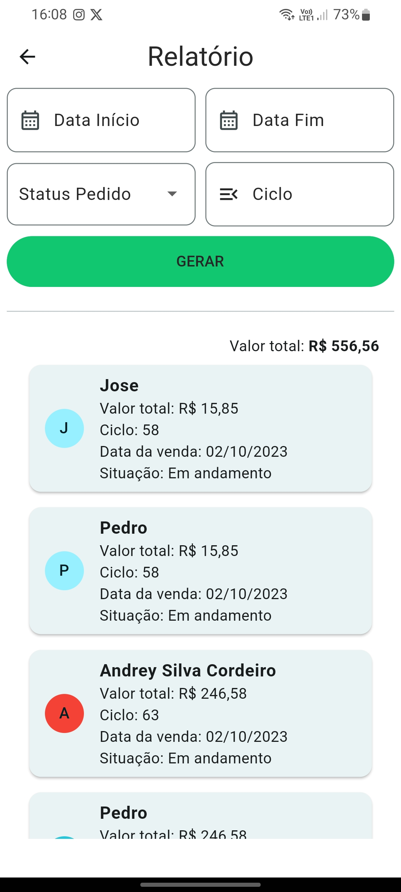
  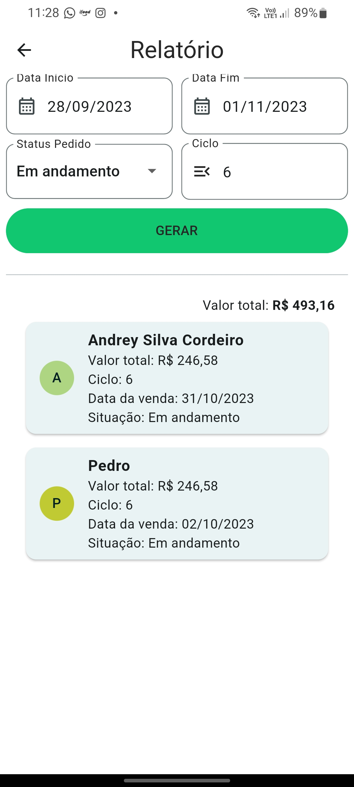

  <h3>Tela de Pedidos</h3>
  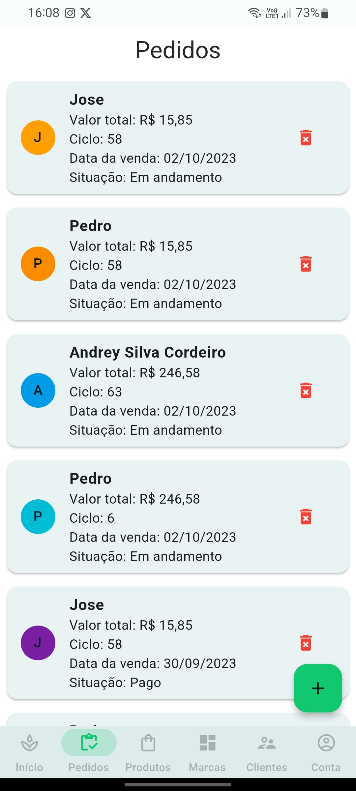

  <h3>Tela de Cadastro de Pedido/Dados de Pagamento</h3>
  
  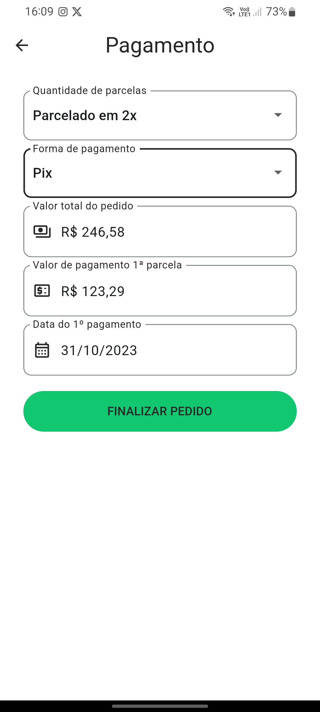

  <h3>Tela de Produtos/Cadastro</h3>
  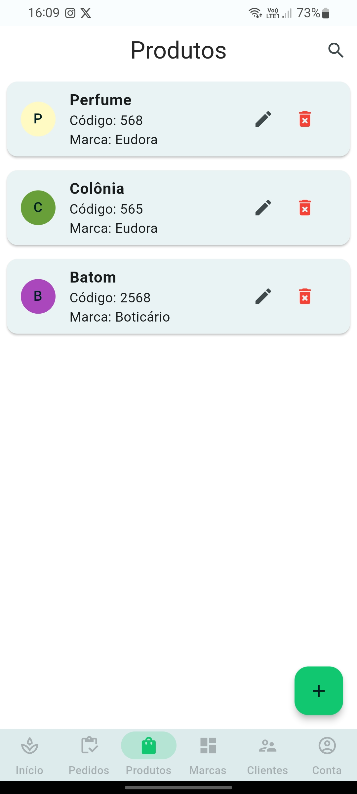
  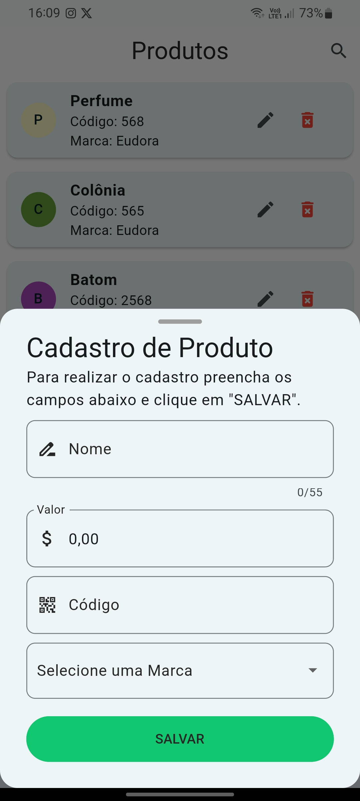

  <h3>Tela de Marcas/Cadastro</h3>
  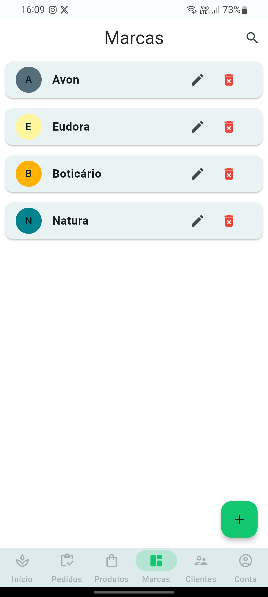
  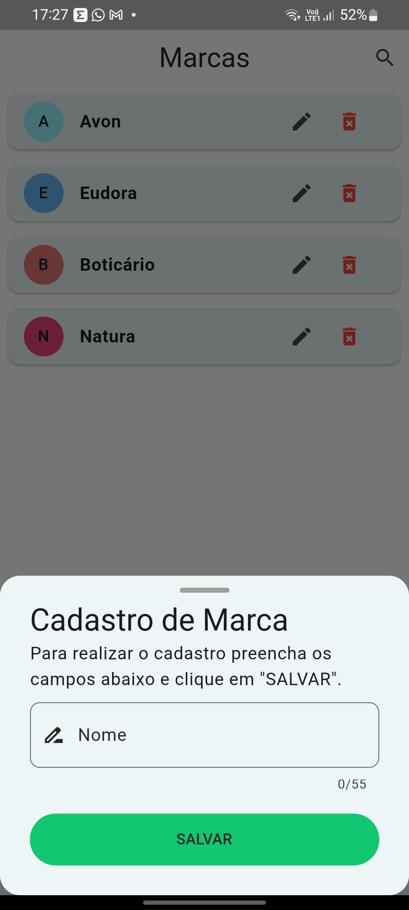

  <h3>Tela de Clientes/Cadastro</h3>
  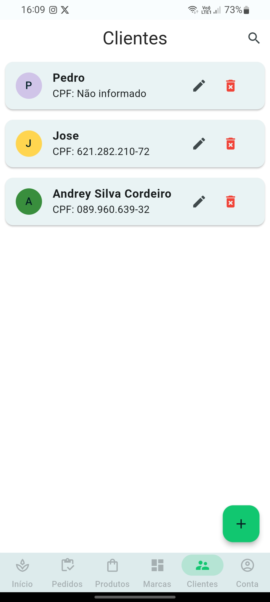
  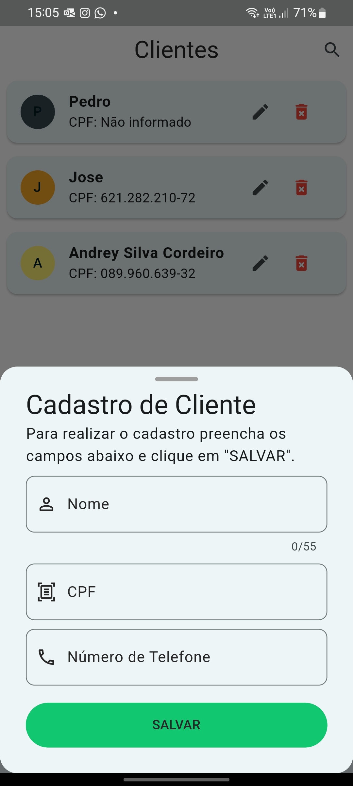

  <h3>Tela de Perfil</h3>
  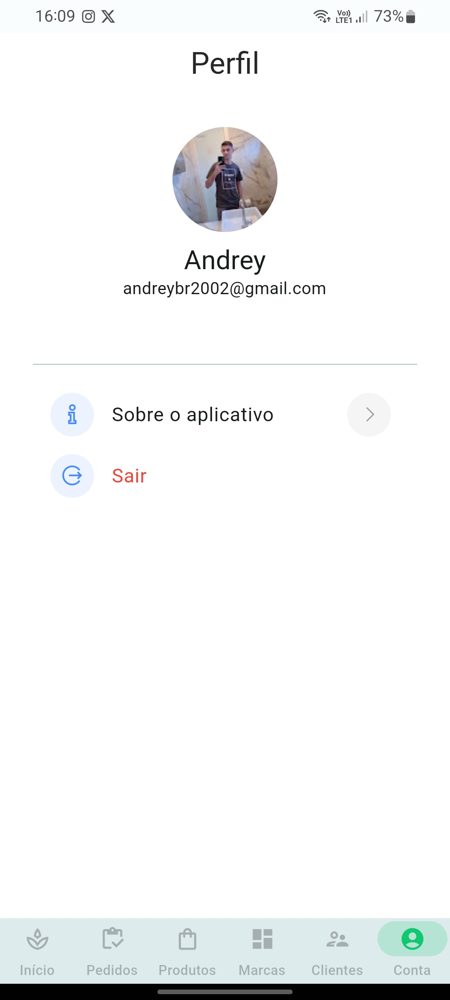

